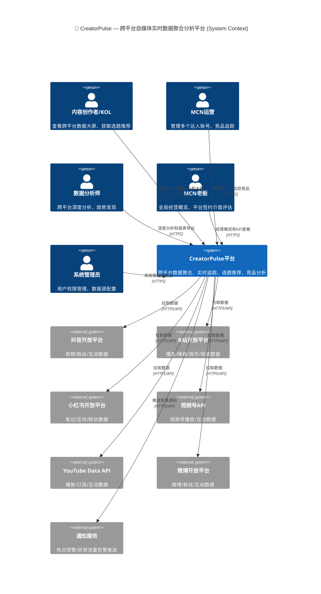
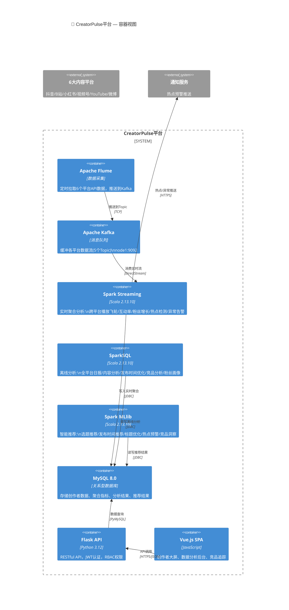
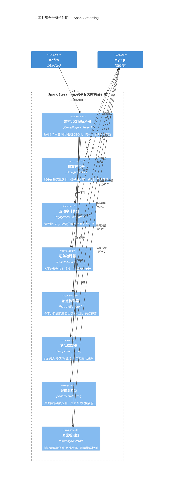
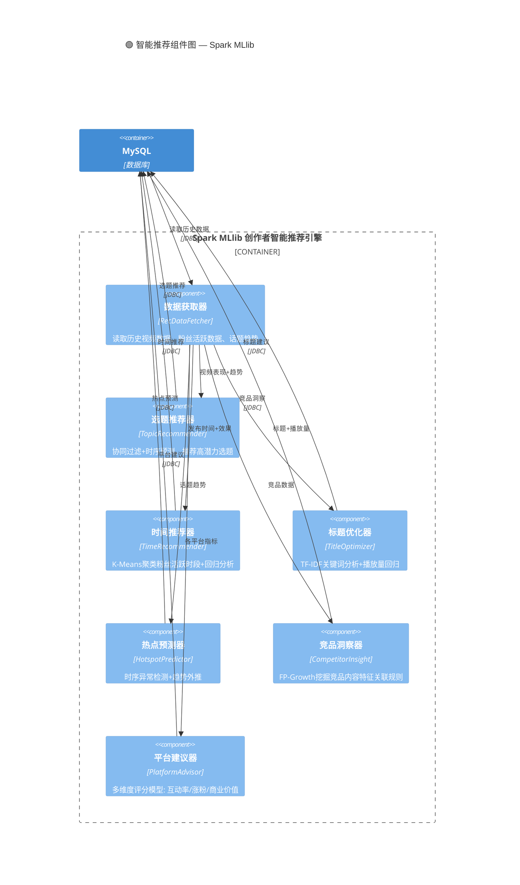
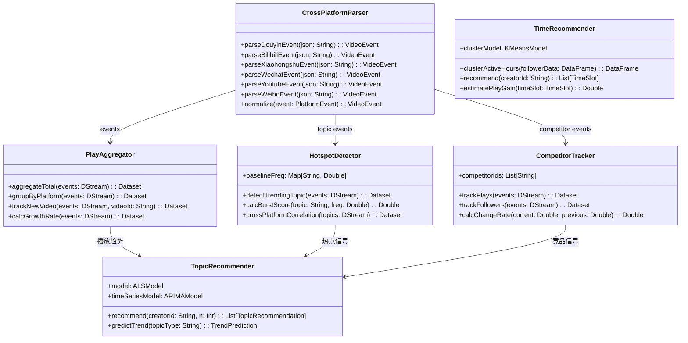

# 🏗️ CreatorPulse — C4 架构视图

> 使用 Mermaid 格式 | 技术栈：Kafka 2.13-3.3.1 | Spark 3.3.1 | Scala 2.13.10 | Python 3.12 | Flask | Vue.js

---

## C1 — 系统上下文图

---

## C2 — 容器视图

---

## C3 — 组件视图

### C3.1 实时聚合分析组件

### C3.2 智能推荐组件

---

## C4 — 核心类图

---

> 📌 详细设计说明书和 SQL 文件可参考此 C4 架构进一步生成。
